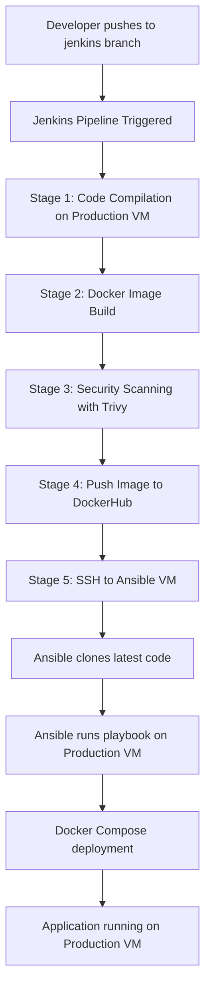

# Task Manager Web Application

## 🛠️ Technology Stack

- **Backend**: Java Servlets, JSP
- **Frontend**: HTML5, CSS3, JavaScript, JSTL
- **Database**: MySQL
- **Containerization**: Docker, Docker Compose
- **Web Server**: Apache Tomcat
- **Build Tool**: Maven
- **CI/CD**: Jenkins Pipeline
- **Configuration Management**: Ansible

## 🏗️ Architecture

The application follows a distributed architecture with separate VMs for different concerns:

- **Jenkins VM**: CI/CD pipeline execution
- **Ansible VM**: Configuration management and deployment orchestration
- **Production VM**: Application deployment target
- **Development VM**: Build and testing environment

### Application Structure

The application follows the MVC (Model-View-Controller) pattern:

- **Model**: Data models and database entities (`User`, `Task`, `Category`)
- **View**: JSP pages for user interface
- **Controller**: Servlets handling HTTP requests and responses
- **Service Layer**: Business logic and data processing

## 📁 Project Structure

```
taskmanager-webapp/
├── src/main/
│   ├── java/com/example/taskmanager/
│   │   ├── controller/          # Servlets
│   │   ├── model/               # Data models
│   │   ├── service/             # Business logic
│   │   └── util/                # Utility classes
│   └── webapp/
│       ├── css/style.css        # Styling
│       ├── js/script.js         # Client-side logic
│       ├── WEB-INF/views/       # JSP pages
│       └── META-INF/context.xml # Database configuration
├── ansible/                     # Ansible deployment configuration
│   ├── playbook.yaml
│   └── roles/deploy/
├── docker-compose.yml           # Multi-container setup
├── Dockerfile                   # Application container
├── Jenkinsfile                  # CI/CD pipeline
├── init.sql                     # Database schema
└── pom.xml                      # Maven configuration
```

## 🚀 How It Works

### Infrastructure Setup

The application operates across **4 separate VMs**:

1. **Jenkins VM** (192.168.56.xxx): CI/CD orchestration
2. **Ansible VM** (192.168.56.210): Configuration management
3. **Production VM** (192.168.56.xxx): Application deployment target
4. **Development VM**: Build and compilation environment

### Setup Requirements

#### 1. Jenkins VM Setup
```bash
# Install Jenkins, Docker, Maven, Trivy
# Configure Jenkins with required plugins
# Set up SSH keys for Ansible VM communication
# Add DockerHub credentials (jenkinsdockercred)
# Add SSH private key credential (ansible-ssh-key)
```

#### 2. Ansible VM Setup
```bash
# Install Ansible and Docker
# Create Python virtual environment at /home/vagrant/myenv/
# Configure SSH access to Production VM
# Install community.docker collection
```

#### 3. Production VM Setup
```bash
# Install Docker and Docker Compose
# Configure firewall for port 8080, 3306
# Set up SSH access for Ansible VM
```

## 🔄 Pipeline Workflow

### Trigger: Push to 'jenkins' branch



## 🔄 Pipeline Workflow

### Comprehensive CI/CD Pipeline Execution

The pipeline operates through **5 distinct stages** across multiple VMs, each serving a specific purpose in the deployment lifecycle:

#### Stage 1: Code Compilation (Production VM Agent)
```bash
Agent: production
Purpose: Build application artifacts
```
- **Maven Execution**: `mvn clean package` compiles Java servlets, JSPs, and creates deployable WAR
- **Dependency Resolution**: Downloads required libraries (Servlet API, MySQL connector, JSTL)
- **Test Execution**: Runs unit tests to ensure code quality
- **Artifact Creation**: Generates `taskmanager-webapp.war` ready for containerization
- **Archive Success**: Jenkins stores WAR file for potential rollbacks and audit trails

#### Stage 2: Docker Image Building (Production VM Agent)
```bash
Command: docker image build -t ${image}:${BUILD_NUMBER} .
Dynamic Tagging: deependrabhatta/java_app:123 (where 123 = Jenkins BUILD_NUMBER)
```
- **Dockerfile Processing**: Uses Tomcat base image, copies WAR file, configures environment
- **Layer Optimization**: Docker builds efficient layers for faster subsequent builds
- **Build Context**: Includes application files, configuration, and startup scripts
- **Tag Strategy**: Each build gets unique tag for version tracking and rollback capability

#### Stage 3: Security Vulnerability Scanning (Production VM Agent)
```bash
Tool: Trivy Scanner
Command: trivy image ${image}:${BUILD_NUMBER}
```
- **Vulnerability Database**: Scans against latest CVE database
- **OS Package Scanning**: Checks base Tomcat image for security issues
- **Application Dependencies**: Analyzes Java libraries for known vulnerabilities
- **Report Generation**: Provides detailed security assessment before deployment
- **Gate Quality**: Pipeline can be configured to fail on high-severity vulnerabilities

#### Stage 4: Image Registry Deployment (Production VM Agent)
```bash
Registry: DockerHub
Authentication: Jenkins stored credentials (jenkinsdockercred)
```
- **Credential Management**: Secure login using Jenkins credential store
- **Image Push**: `docker push ${image}:${BUILD_NUMBER}` uploads to public/private registry
- **Registry Verification**: Confirms successful upload and availability
- **Tag Management**: Maintains version history for rollback scenarios

#### Stage 5: Ansible Deployment Orchestration (Master Node)
```bash
Target: Ansible VM (192.168.56.210)
Method: SSH with private key authentication
```
- **SSH Connection**: Jenkins master connects to Ansible VM using stored SSH key
- **Environment Preparation**: Cleans previous deployment workspace, clones fresh code
- **Python Environment**: Activates virtual environment with Ansible dependencies
- **Collection Installation**: `ansible-galaxy collection install community.docker`
- **Playbook Execution**: `ansible-playbook playbook.yaml -e "build_number=${BUILD_NUMBER}"`

## 🔗 Connection Flow

### Detailed Inter-VM Communication and Data Flow

#### Step 1: Development Trigger
```
Developer Workstation → GitHub Repository (jenkins branch)
- Git push triggers GitHub webhook
- Webhook payload includes commit information and branch details
```

#### Step 2: Jenkins Orchestration
```
GitHub Webhook → Jenkins VM → Production VM (labeled "production")
- Jenkins receives webhook, validates branch = 'jenkins'
- Pipeline allocates build executor on Production VM agent
- Agent establishes connection for build execution
```

#### Step 3: Build Execution Flow
```
Jenkins Master → Production VM Agent:
1. Source Code Checkout (Git clone from repository)
2. Maven Build Process (compile, test, package)
3. Docker Operations (build, tag, scan, push)
4. Artifact Archival (store WAR files in Jenkins)
```

#### Step 4: Deployment Coordination
```
Jenkins Master → Ansible VM (192.168.56.210):
SSH Connection: /var/lib/jenkins/keys/id_rsa
Commands Executed:
- rm -rf /home/vagrant/java (clean workspace)
- git clone --single-branch --branch jenkins <repo>
- source /home/vagrant/myenv/bin/activate
- cd ansible && ansible-playbook playbook.yaml
```

#### Step 5: Ansible-to-Production Communication
```
Ansible VM (192.168.56.210) → Production VM:
Inventory Target: Production VM IP/hostname
Authentication: SSH key-based authentication
Playbook Execution:
- 01_setup.yaml: Environment preparation
- 02_configs.yaml: Configuration management
- 03_deploy.yaml: Docker Compose execution
- 04_cleanup.yaml: Resource optimization
```

#### Step 6: Container Orchestration
```
Production VM Docker Engine:
1. Pull Image: docker pull deependrabhatta/java_app:${BUILD_NUMBER}
2. Environment Setup: Export DATABASE_URL, credentials
3. Compose Execution: docker-compose up -d
4. Health Verification: Wait for MySQL health check
5. Application Start: Tomcat serves on port 8080
```

#### Step 7: Service Availability
```
Production VM:8080 → End Users
- MySQL Database: localhost:3306 (internal network)
- Web Application: Production VM IP:8080 (external access)
- Health Monitoring: Docker health checks every 10 seconds
- Log Aggregation: Container logs available via docker logs
```

## 🗄️ Database Schema

The application uses MySQL with three main tables:

- **users**: User accounts and authentication
- **tasks**: Task information with priorities and due dates
- **categories**: Customizable task categories with colors

## 🛡️ API Endpoints

| Method | Endpoint | Description |
|--------|----------|-------------|
| GET | `/` | Home page |
| GET/POST | `/login` | User authentication |
| GET/POST | `/register` | User registration |
| GET | `/dashboard` | User dashboard |
| GET/POST | `/tasks` | Task management |
| GET/POST | `/profile` | User profile management |
| POST | `/categories` | Category creation |
| GET | `/logout` | User logout |


**Note**: This application uses automated CI/CD deployment. Ensure proper VM configuration and network connectivity between Jenkins, Ansible, and production environments.